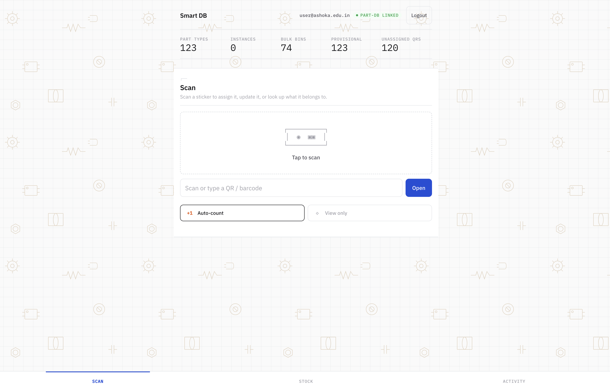
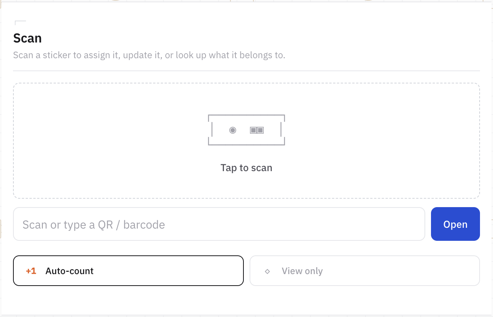
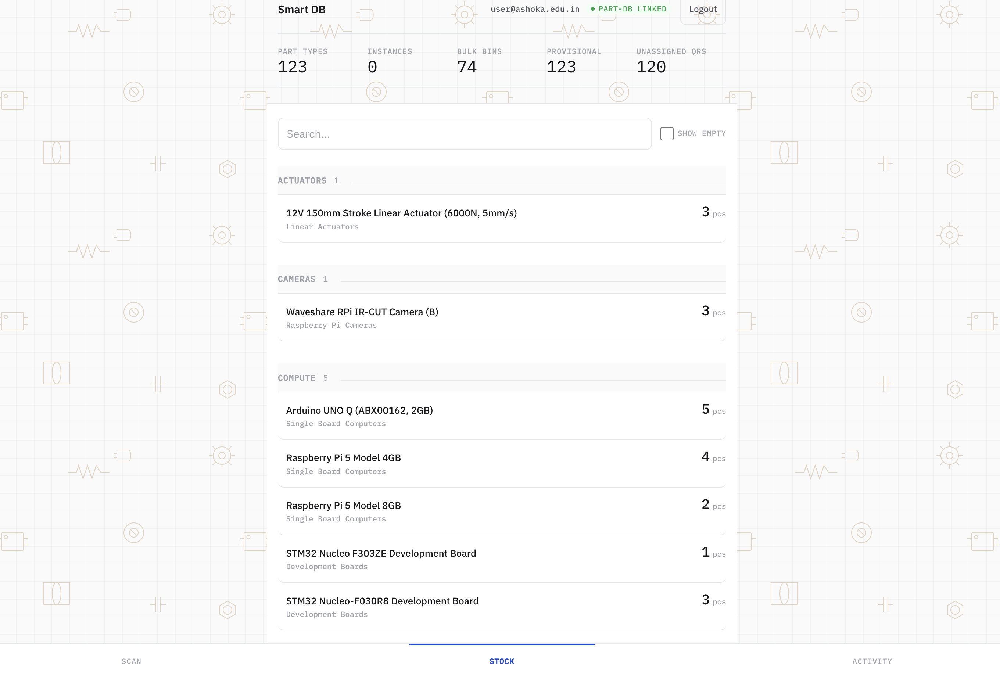

<p align="center">
  
</p>

<p align="center">
  A fast-ingest inventory system for university makerspaces.<br/>
  Built for the Mphasis AI & Applied Tech Lab at Ashoka University.
</p>

<p align="center">
  <a href="https://github.com/psygos/smart-db/actions/workflows/ci.yml"></a>
</p>

<p align="center">
  
</p>

## Problem

Lab equipment arrives in bulk. Purchase orders list 60+ line items across motors, sensors, filaments, batteries, dev boards. Each item needs to be cataloged, counted, located, and eventually tracked when handed out to students. Doing this in a spreadsheet is slow and error-prone. Part-DB provides a rich catalog UI but has no fast-intake workflow.

## Solution

Smart DB puts a phone-first scanning interface in front of a typed inventory backend. A lab manager scans barcodes (manufacturer or QR), assigns part types from a pre-seeded catalog, and the system tracks quantities, locations, and check-out history. Every write is mirrored to a self-hosted [Part-DB](https://part-db.github.io/) instance through a durable outbox.

### Intake flow

<p align="center">
  
</p>

1. Scan a manufacturer barcode on a product box. Smart DB looks up the part type from the catalog.
2. If the barcode is new, a registration form opens with category, unit, and location fields.
3. First scan creates the record. Subsequent scans of the same barcode increment the bulk quantity.
4. Pre-printed QR stickers can be assigned to individual items for lifecycle tracking (checked out, returned, damaged, lost).

### Stock overview

<p align="center">
  
</p>

The stock page shows all part types grouped by category with live quantities. Each row expands to reveal individual bins with QR codes and locations. The background features a tiling SVG wallpaper of technical drawings (gears, resistors, IC chips, bolts, spools) on graph paper -- a nod to the makerspace environment.

### Part-DB sync

Every inventory write is enqueued in a SQLite-backed outbox. A background worker delivers operations to Part-DB over its JSON-LD API with retry, exponential backoff, and dead-letter handling. If Part-DB is down, Smart DB keeps working. The outbox catches up on recovery.

## Architecture

```
Phone/Scanner --> Caddy (TLS) --> Fastify API --> SQLite
                                       |
                                  Outbox worker --> Part-DB (Symfony)
```

| Package | Stack | Role |
|---------|-------|------|
| `packages/contracts` | Zod, TypeScript | Shared schemas, FSM transition tables, Result types |
| `apps/middleware` | Fastify 5, node:sqlite | API server, domain logic, outbox worker |
| `apps/frontend` | React 19, Vite | Phone-first scanning and management UI |

Deployed via Docker Compose on a self-hosted runner with CI/CD through GitHub Actions. Three containers: Caddy gateway, Node.js middleware, Part-DB.

## Barcode scanning

Hybrid detection strategy that works on every modern mobile browser over HTTPS:

- **jsQR** (pure JS, 150ms interval) for QR codes.
- **barcode-detector** (zxing-wasm polyfill, background init) for 1D barcodes: EAN-13, EAN-8, Code 128, Code 39, UPC-A/E, ITF.
- WASM binary self-hosted. No CDN. Works on air-gapped networks.
- Hardware USB wedge scanners supported (input auto-clears between scans).

## Part-DB typed layer

The middleware wraps Part-DB's API Platform with a fully typed client:

- REST client with `application/ld+json` reads/writes, `application/merge-patch+json` for PATCH, Zod response validation, structured error taxonomy (10 error kinds).
- Hydra collection unwrapping (extracts `hydra:member` from JSON-LD envelopes).
- Category resolver that walks slash-separated paths (`Materials/3D Printing Filament/PLA`), creates missing nodes top-down, caches IRIs with case-insensitive keys.
- Outbox with 8 operation kinds, SHA256 idempotency, dependency chains, lease-based concurrency, 10-attempt max with backoff, admin visibility.

## State machines

Five FSMs govern all stateful entities (full transition tables in [CLAUDE.md](CLAUDE.md)):

| Entity | States | Key rule |
|--------|--------|----------|
| QR Code | printed, assigned, voided | Void cascades to inventory entity |
| Physical Instance | available, checked_out, consumed, damaged, lost | consumed is terminal |
| Bulk Stock | derived from quantity (good/low/empty) | 5 event types with quantity guards |
| Part Type | needsReview boolean | Merge transfers inventory, deletes source |
| Outbox Row | pending, leased, delivered, failed, dead | Dependency ordering, lease expiry |

## Development

```bash
pnpm install
pnpm dev              # frontend :5173 + middleware :4000
pnpm typecheck        # tsc --noEmit, strict mode
pnpm test             # state/failure-focused test suite
```

TypeScript strict mode with `noUncheckedIndexedAccess` and `exactOptionalPropertyTypes`. Zod validation at all system boundaries.

## Deployment

```bash
cd deploy
docker compose build --no-cache
docker compose up -d
```

Pushes to `main` trigger CI (typecheck + test on GitHub cloud) then auto-deploy via a self-hosted runner on the lab server. Environment variables in `deploy/config/*.env` (gitignored).

## Catalog seeding

Seed scripts parse purchase orders into typed part-type records with hierarchical categories:

| Script | Items | Unit |
|--------|-------|------|
| `seed-catalog.ts` | 61 Robu.in electronics | pcs |
| `seed-fdm-filaments.ts` | 44 eSUN/SunLU FDM filaments | kg |
| `seed-sla-resins.ts` | 15 SLA/MSLA resins | L/kg |

## Rewrite Status

The rewrite is now the active frontend.

### Frontend architecture

- React has been removed from the live UI. The browser entrypoint is now plain TypeScript, HTML, and CSS.
- The old god component is gone. The rewrite uses a typed controller, route-oriented render modules, and explicit machine boundaries for auth and scan flows.
- Auth and scan lifecycle are driven by XState actors. Form submission no longer depends on loose request bags or placeholder values.
- The initial HTML shell is present in `index.html`, so the app no longer boots from a blank page while JavaScript starts.

### Data model

- Countable part types can now own both individually tracked units and pooled stock.
- The database schema remains unchanged. The mixed model is implemented in the service and UI layers by allowing one `part_type_id` to back both `physical_instances` and `bulk_stocks`.
- This means intake can begin as a quantity pool and later branch into tracked units without forcing a duplicate part type.

### Error handling

- Form submission is parse-first. Assignment, event, batch, and merge flows use typed parsers that return `Result` values with structured failures.
- Camera scanning has an explicit failure taxonomy for capability, permission, acquisition, playback, scan-frame, and unexpected errors.
- Error messages are field-specific and recovery-aware instead of generic transport copy.

### Testing

- The frontend test suite is now centered on state machines, parser failures, camera lifecycle failures, controller state transitions, and backend resilience.
- Performative React-only component tests were removed with the React shell.
- Middleware tests still cover inventory behavior, sync resilience, migrations, idempotency, auth, and end-to-end intake/lifecycle flows.

## License

Internal project. Ashoka University, Mphasis AI & Applied Tech Lab.
