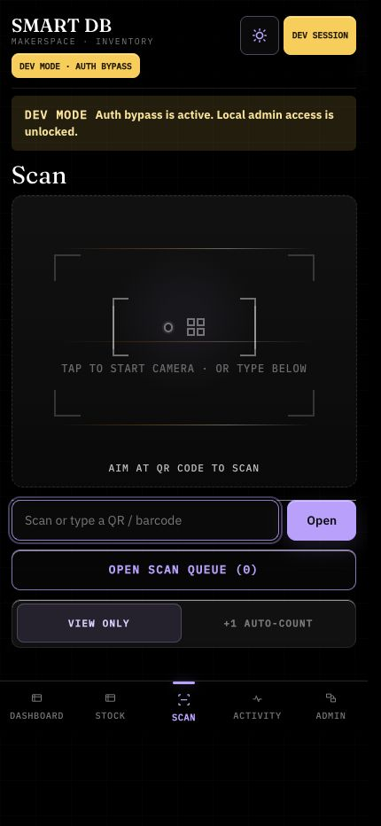
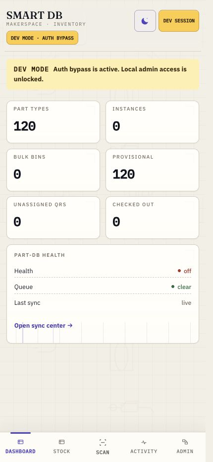
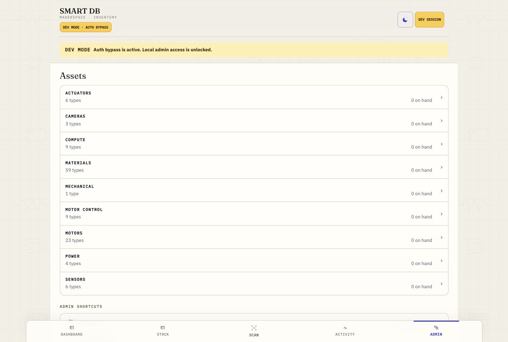

<p align="center">
  
</p>

<p align="center">
  Inventory intake and issue tracking for the Ashoka makerspace.
</p>

<p align="center">
  <a href="https://github.com/Makerspace-Ashoka/smart-db/actions/workflows/ci.yml"></a>
  <a href="https://github.com/Makerspace-Ashoka/smart-db/releases/tag/v1.0.0"></a>
</p>

Smart DB is a small operational system for a university makerspace. It is built around the moment when parts enter or leave the lab: scan a QR code or manufacturer barcode, identify the part, assign it to a shelf or person, and keep the inventory history readable.

Part-DB remains the richer catalog and reporting surface. Smart DB is the fast front door in front of it, with its own SQLite source of truth and a durable outbox that mirrors changes to Part-DB when sync is enabled.

<p align="center">
  
  
</p>

<p align="center">
  
</p>

The screenshots above were captured from local dev mode, so the yellow auth-bypass banner is intentionally visible. Production builds use the same responsive shell without the dev-mode warning.

## What It Handles

Smart DB supports two inventory styles in the same catalog:

- Individually tracked items, such as tools, boards, batteries, and anything that needs a lifecycle state.
- Bulk stock, such as filament, resin, fasteners, tape, and other quantity-managed supplies.

The main workflow is phone-first. A lab operator can scan, assign, issue, return, move, consume, or mark damage from the bottom-tab app shell. Desktop views keep the same navigation model but give more space to the dashboard, catalog groups, admin tools, and sync status.

## PWA And Responsive Behavior

The frontend ships as an installable web app:

- `manifest.webmanifest` declares app icons, maskable icons, theme color, and standalone display mode.
- The production Vite build emits a service worker from `service-worker.template.js` and caches the app shell.
- A state-aware install banner is shown only when installation makes sense. It is hidden when the app is already running as an installed PWA, after a dismiss, or after the user chooses never to show it again.
- The UI uses safe-area padding, bottom navigation, large touch targets, and fixed scan controls so it behaves like an app on phones rather than a squeezed desktop page.

## Stack

| Area | Stack | Notes |
|------|-------|-------|
| Frontend | TypeScript, Vite, DOM rendering, XState | No framework runtime. The controller renders plain HTML and keeps state in explicit machines where the workflow benefits from it. |
| Scanner | `jsQR`, `barcode-detector`, ZXing WASM | QR and 1D barcode support. The WASM file is self-hosted for local-network use. |
| Contracts | TypeScript, Zod | Shared schemas, typed errors, result helpers, and inventory transition helpers. |
| Middleware | Fastify 5, Node 24, `node:sqlite` | API, auth/session handling, inventory service, QR labels, and Part-DB sync orchestration. |
| Sync | SQLite outbox, Part-DB JSON-LD API | Smart DB writes locally first. The outbox retries Part-DB projection work without blocking ordinary intake. |
| Deployment | Docker Compose, Caddy, GitHub Actions | Caddy serves the frontend and TLS, middleware runs as a Node container, and Part-DB runs beside it. |

## State And Correctness

There are two related state layers.

The domain transition rules live in `packages/contracts/src/transitions.ts`. Physical instances move through `available`, `checked_out`, `damaged`, `lost`, and terminal `consumed` states. Bulk stock is quantity-based: restock, consume, stocktake, adjust, and move events calculate the next quantity and reject impossible transitions such as consuming more than exists.

The frontend currently has three implemented XState machines: `auth`, `scanSession`, and `bulkQueue`. `apps/frontend/src/rewrite/machine-map.ts` also records planned machines for route loading, connectivity, camera, batch admin, merge admin, and sync admin. That map is documentation for the rewrite boundary; the implemented machines are exported from `apps/frontend/src/rewrite/machines/index.ts`.

QR assignment, part review, and Part-DB outbox handling have service-level lifecycles too, but they are not all represented by one central FSM table. When changing behavior, treat the code and tests around `InventoryService`, `PartDbOutbox`, and `packages/contracts/src/transitions.ts` as authoritative.

## Development

```bash
pnpm install
pnpm dev
pnpm typecheck
pnpm build
pnpm test
```

Local dev can run without SSO:

```bash
# apps/middleware/.env
DEV_AUTH_BYPASS=true

# apps/frontend/.env
VITE_DEV_AUTH_BYPASS=true
```

The bypass is intended for localhost development. The UI shows a persistent `DEV MODE · AUTH BYPASS` warning and a dev-session pill when it is active.

## Deployment

The production stack lives in `deploy/`.

```bash
cd deploy
docker compose build --no-cache
docker compose up -d
```

The compose stack runs:

- `gateway`: Caddy serving the built frontend, TLS, app security headers, and reverse proxy routes.
- `middleware`: Node 24 Fastify API with the Smart DB SQLite database mounted under `deploy/state/smartdb/data`.
- `partdb`: a pinned Part-DB image with its SQLite database, uploads, and public media mounted under `deploy/state/partdb`.

Pushes to `main` run the shared check workflow, then deploy through the self-hosted `smartdb` runner. The production workflow rsyncs the repository to `/opt/smart-db`, rebuilds the gateway and middleware images, starts the compose project, and checks both middleware and gateway health before finishing. See `deploy/README.md` for runtime paths, TLS notes, and backup behavior.

## Catalog Seeding

The middleware includes seed scripts for the current makerspace catalog:

| Script | Contents |
|--------|----------|
| `seed-catalog.ts` | Electronics, boards, motors, sensors, power, cameras, and actuators. |
| `seed-fdm-filaments.ts` | FDM filament materials and colors. |
| `seed-sla-resins.ts` | SLA/MSLA resin materials. |

## License

Internal project. Ashoka University, Mphasis AI & Applied Tech Lab.
